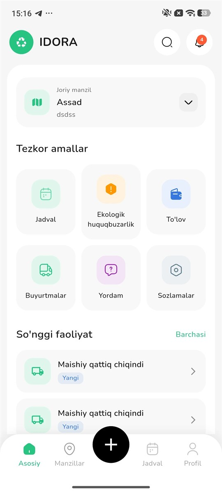
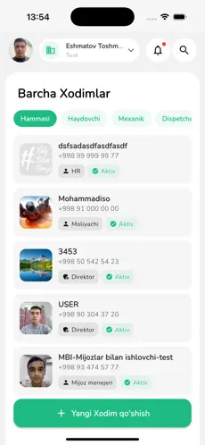
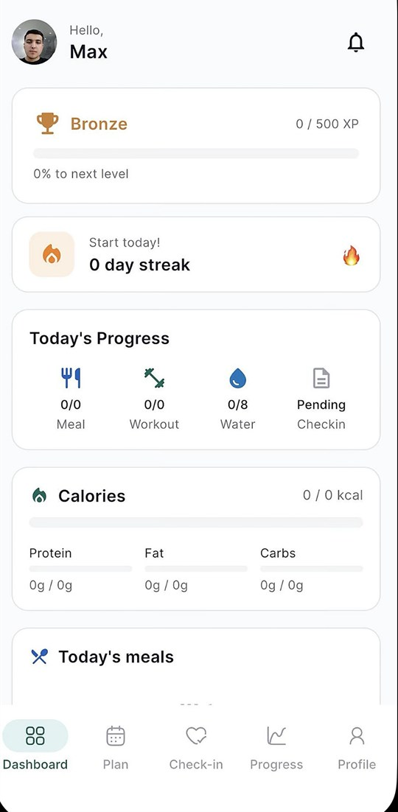

<a href="https://makhmudjon.me">
  
</a>

<p align="center">
  <a href="https://makhmudjon.me"></a>
  <a href="https://makhmudjon.me/cv"></a>
  <a href="https://www.linkedin.com/in/maxmudjon-abdumuratov-81373229b"></a>
  <a href="mailto:abdumuratov1991@gmail.com"></a>
  <a href="https://stackoverflow.com/users/28601108/lonewonderer"></a>
  <a href="https://leetcode.com/lonewonderer"></a>
  <a href="https://instagram.com/abdumuratov_m_"></a>
</p>


### 👋 About me

I'm a Flutter developer from Tashkent 🇺🇿. I build mobile apps for iOS and Android from one codebase — from the first screen in Figma to the version sitting in the store. I care about the part people see and the part they don't: clean architecture, smooth interactions and an interface that earns its place on the screen.

```dart
class Makhmudjon extends FlutterDeveloper {
  final location     = 'Tashkent, Uzbekistan';
  final architecture = ['Clean Architecture', 'MVVM', 'SOLID', 'Design Patterns'];
  final state        = ['BLoC', 'Riverpod'];
  final backend      = ['Firebase', 'Supabase', 'REST API', 'PostgreSQL', 'Hive'];
  final shipped      = 3; // live on the App Store & Google Play

  @override
  String get motto => 'Building apps people keep.';
}
```

### 📱 Shipped apps

<table>
  <tr>
    <td align="center" width="33%">
      <br />
      <b>IDORA Public</b><br />
      Waste collection for Uzbek households — schedules, contracts, Payme / Click payments, and AI that sizes a pickup from photos.<br /><br />
      <a href="https://apps.apple.com/uz/app/idora-public/id6762111172"></a>
      <a href="https://play.google.com/store/apps/details?id=uz.idora.clientapp"></a>
    </td>
    <td align="center" width="33%">
      <br />
      <b>IDORA Business</b><br />
      An enterprise app where thirteen roles — dispatch, fleet, warehouse, HR, finance — each get their own view of one company.<br /><br />
      <a href="https://apps.apple.com/uz/app/idora-business/id6762111659"></a>
      <a href="https://play.google.com/store/apps/details?id=uz.idora.workerapp"></a>
    </td>
    <td align="center" width="33%">
      <br />
      <b>Eat&amp;Fit</b><br />
      An AI nutrition and fitness coach built for Uzbekistan — meal plans, workouts and daily check-ins that adapt to you.<br /><br />
      <a href="https://apps.apple.com/uz/app/eat-and-fit/id6788250871"></a>
      <a href="https://play.google.com/store/apps/details?id=uz.eurosoft.eatandfeat"></a>
    </td>
  </tr>
</table>

### 🧩 Open source

| Project | What it is | Stack |
| --- | --- | --- |
| [**Numi**](https://github.com/MakhmudjonA/Numi) | Calorie tracker that reads a meal from a photo and keeps every log on the device | Flutter · BLoC · Hive · Clarifai AI |
| [**Kursol**](https://github.com/MakhmudjonA/kursol) | Online course app — lessons, progress and downloads that work offline | Flutter · BLoC · Dio · Hive |
| [**Musium**](https://github.com/MakhmudjonA/musium) | Offline music player — no account, no server, no internet | Flutter · Clean Architecture · Hive |
| [**Warder Do**](https://github.com/MakhmudjonA/warder_do_mobile) | Habit tracker with token auth and habits that sync across devices | Flutter · dartz · REST API |
| [**CalcMate**](https://github.com/MakhmudjonA/CalcMate) | Calculator with a live result, history and unit-tested logic | Flutter · math_expressions |
| [**ESP32 NAT Router**](https://github.com/MakhmudjonA/esp32_nat_router) | ESP32 WiFi repeater controlled from Telegram, with DNS filtering | C · ESP-IDF · PlatformIO |

### 🛠 Stack



### 📄 CV

Always up to date on my site: **[makhmudjon.me/cv](https://makhmudjon.me/cv)** · or grab the **[PDF](https://makhmudjon.me/cv.pdf)**.


<picture>
  <source media="(prefers-color-scheme: dark)" srcset="https://raw.githubusercontent.com/MakhmudjonA/MakhmudjonA/output/snake-dark.svg" />
  
</picture>

<p align="center"><sub>Open to Flutter roles, contracts and interesting ideas — <a href="mailto:abdumuratov1991@gmail.com">say hi</a>.</sub></p>
